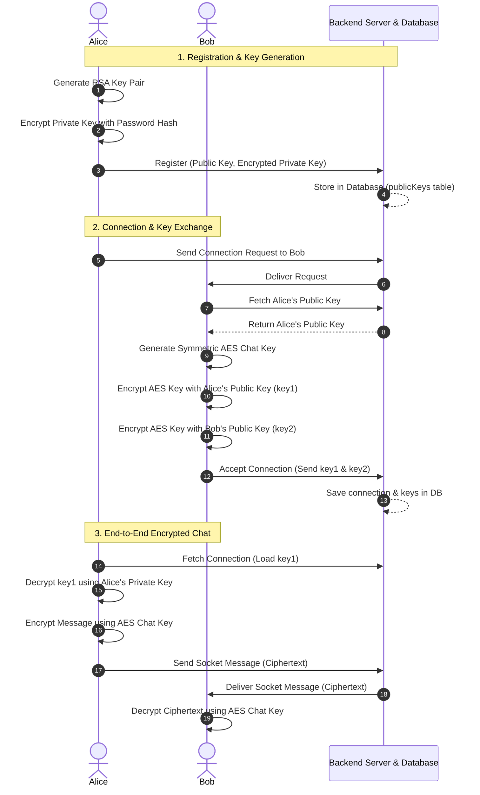

# Stealth Chat

Stealth Chat is a secure, real-time messaging application designed with privacy as the main focus. It uses End-to-End Encryption (E2EE) on the client side, meaning that messages and files are decrypted only on the users' devices and are never stored in plain text on the server.

---

## Architecture Overview

The application is built using the following components:

*   **Frontend:** Vite, React 19, TailwindCSS, Zustand (for state management), React Hook Form, and Lucide React.
*   **Backend:** Node.js, Express, Socket.io (for WebSockets), and Drizzle ORM.
*   **Database:** PostgreSQL (Neon Serverless DB).
*   **Cache and Scale Layer:** Redis (used for Socket.io communication across server instances, user presence tracking, rate limiting, and caching database queries).

---

## Cryptographic Design (E2EE Key Exchange)

Stealth Chat secures conversations by combining two types of encryption: RSA (key pairs) and AES (symmetric keys).

1.  **Registration:** When a user signs up, the browser generates an RSA key pair (a public key and a private key). The private key is encrypted locally using the user's password hash and then saved on the database along with the public key.
2.  **Connection:** When two users connect, a unique AES chat key is generated. This key is encrypted twice: once with the sender's public key and once with the receiver's public key, and then stored in the database.
3.  **Chatting:** When sending a message, the app retrieves the encrypted AES key, decrypts it using the user's private key, and encrypts the message contents using that AES key. The server only receives encrypted text.

### Key Exchange and Message Flow



---

## Core Features

*   **End-to-End Encryption:** Messages and file attachments are encrypted locally before being sent over sockets or stored in the database.
*   **Optimistic UI Updates:** Messages immediately show up on the sender's screen as "sending" (clock icon) or "failed" (warning icon) to ensure responsive feedback.
*   **Reconnection Sync:** The app automatically fetches missed messages from the database when the socket connection is restored.
*   **Horizontal Scalability:** The server uses a Redis adapter to sync real-time socket events across multiple backend servers.
*   **Presence and Typing Indicators:** User online status and typing states are tracked globally using Redis.
*   **Rate Limiting:** Protects the server from excessive socket messages using a sliding-window rate limit (100 events / 10s) backed by Redis.
*   **Database Query Caching:** Active chat details are cached in Redis to avoid redundant database lookups for every sent message.

---

## Configuration and Environment Setup

To run Stealth Chat locally, set up the environment variables for the frontend and backend.

### Server Environment Configuration (`server/.env`)
Create a `.env` file in the `server` directory:
```env
PORT=3000
POSTGRESSQL_URL=your_postgresql_connection_string
JWT_SECRET=your_jwt_secret_key
CLIENT_URL=http://localhost:5173
REDIS_URL=redis://localhost:6379

# Cloudinary Storage Configuration
CLOUDINARY_CLOUD_NAME=your_cloudinary_cloud_name
CLOUDINARY_API_KEY=your_cloudinary_api_key
CLOUDINARY_API_SECRET=your_cloudinary_api_secret

# SMTP configuration for alerts
ADMIN_EMAIL=your_admin_email
SMTP_HOST=your_smtp_host
SMTP_PORT=587
SMTP_USER=your_smtp_user
SMTP_PASS=your_smtp_password
```

### Client Environment Configuration (`client/.env`)
Create a `.env` file in the `client` directory:
```env
VITE_API_URL=http://localhost:3000
```

---

## Local Development Installation

### Prerequisites
*   Node.js (version 18 or higher)
*   PostgreSQL database (local instance or cloud database like Neon)
*   Redis server (running locally or via Docker)

### Step 1: Clone the Project and Install Dependencies
```bash
# Clone the repository
git clone https://github.com/Mani-Chandra65/Stealth-Chat.git
cd Stealth-Chat

# Install backend dependencies
cd server
npm install

# Install frontend dependencies
cd ../client
npm install
```

### Step 2: Set up Database Schema
Push the database schemas to PostgreSQL:
```bash
cd ../server
npx drizzle-kit push
```

### Step 3: Start the Application
Open two separate terminal windows:

*   **Terminal 1 (Backend):**
    ```bash
    cd server
    npm run dev
    ```
*   **Terminal 2 (Frontend):**
    ```bash
    cd client
    npm run dev
    ```

Open your browser and navigate to `http://localhost:5173`.

---

## Deploying to Production

*   **Frontend:** The frontend compiles to static files and can be hosted on platforms like Netlify or Vercel. Ensure `VITE_API_URL` is set in the hosting provider's build variables.
*   **Backend:** The backend runs as a Node.js server on platforms like Render or Heroku. Make sure WebSockets are enabled, a Redis instance is connected, and environment variables are set.
